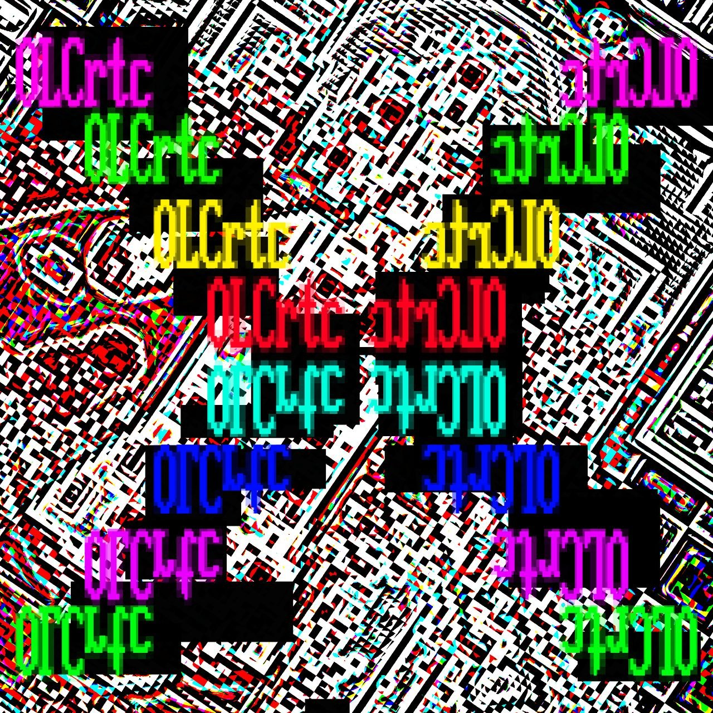

## About
olcRTC - out beyond

Project that allows users to bypass blocking by parasitizing and tunneling on unblocked and whitelisted services in Russia

By zarazaex & openlibrecommunity

Made for [olcNG](https://github.com/zarazaex69/olcng)

 

---

### Contact

Telegram: [zarazaex](https://t.me/zarazaexe)
 
Email: [zarazaex@tuta.io](mailto:zarazaex@tuta.io)
 
Site: [zarazaex.xyz](https://zarazaex.xyz)
 

